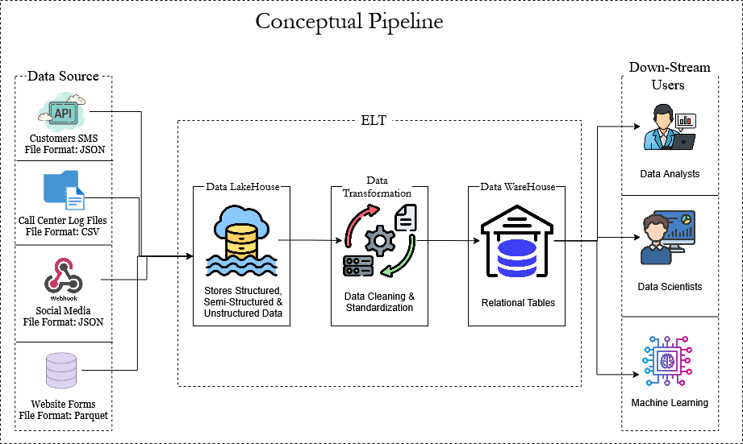

# Data Pipeline Design

## Source Identification
- **SMS Complaints**  
  - Source: SMS providers via APIs  
  - Format: JSON  
  - Ingestion Mode: Batch (called at intervals)  

- **Call Center Log Files**  
  - Source: CRM Systems (exported log files)  
  - Format: CSV (flat files)  
  - Ingestion Mode: Batch (at intervals)  

- **Social Media Data**  
  - Source: Social platforms via Webhooks  
  - Format: JSON  
  - Ingestion Mode: Streaming (real-time)  

- **Website Forms**  
  - Source: OLTP Database  
  - Format: Parquet (after extraction)  
  - Ingestion Mode: Batch  

## Storage
- Store extracted data in a **Data Lakehouse** to combine functionalities of both a data lake and a data warehouse.  
- Supports structured, semi-structured, and unstructured data.  

## Processing / Transformation
- Clean and transform data to ensure consistency and quality:  
  - Handle missing values  
  - Remove duplicates  
  - Standardize column names and datatypes  
  - Use correct date & time formats  
  - Apply aggregations and filters, e.t.c
- Store cleaned data in **Parquet format** for optimization and cost-effectiveness.  

## Serving
- Transform cleaned data into **relational tables**.  
- Serve data in a **data warehouse** for downstream users:  
  - BI Analysts  
  - Data Scientists  
  - Machine Learning models  

## Orchestration & Monitoring
- **SMS Data:** Batch every 15 minutes  
- **Social Media Data:** Real-time (Webhook-driven)  
- **Call Center Log Files:** Batch every 12 hours  
- **Website Forms:** Batch every 15 minutes  
- Pipeline failure will be detected through logging ,monitoring and alerts.
- SO we are having an hybrid approach

## DataOps
- Pipeline runs in the **cloud** for scalability.  
- Approach: **ELT (Extract, Load, Transform)**  
  - Extract and load raw data into the Data Lakehouse  
  - Transform data for downstream use  
  - Load into Data Warehouse for analytics and reporting  
- Monitoring and alerting ensure reliability and resilience.  
